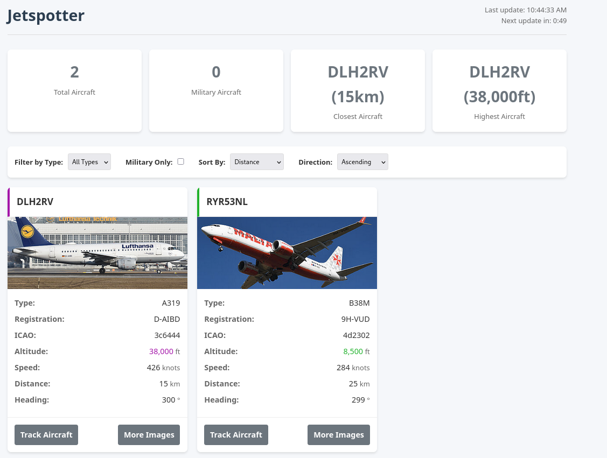
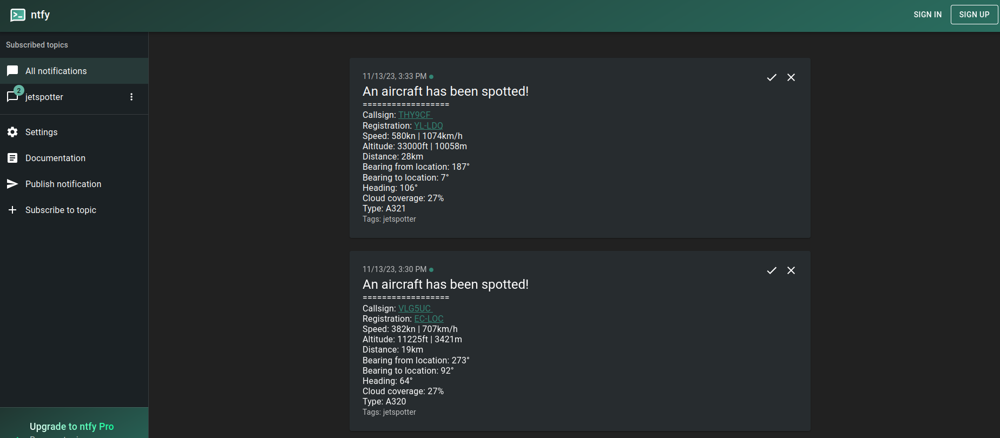
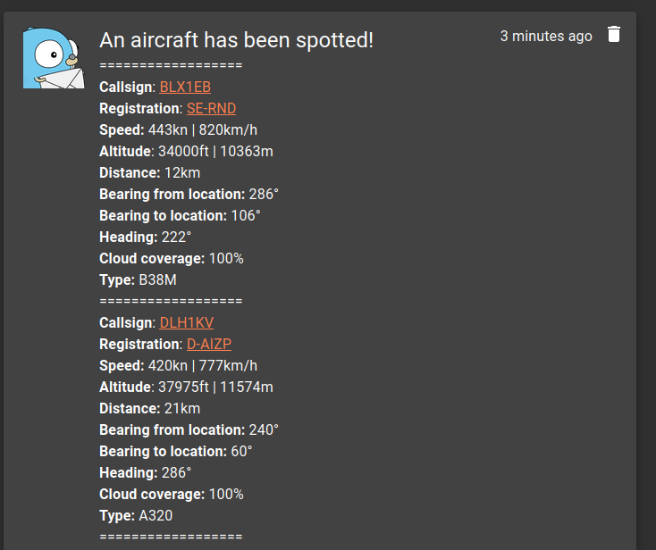
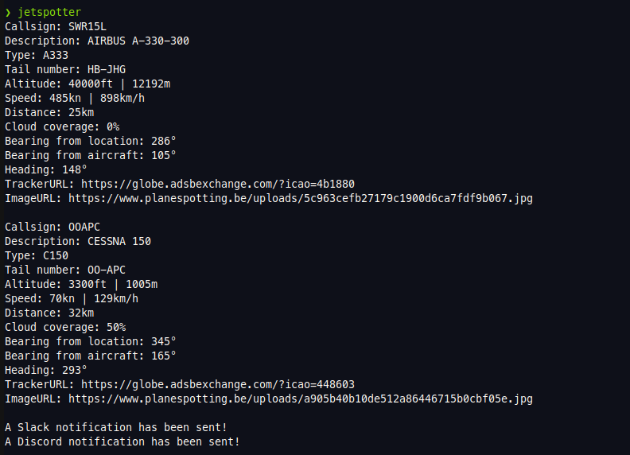

# Jetspotter

  

Jetspotter is a simple program that queries the ADS-B API. It is used to send notifications if a specified type of aircraft has been spotted within a specified range of a target location. If one or more jets have been spotted, a notification is sent. The notification contains some metadata about the aircraft, a picture fetched from planespotters.net and a link to track the aircraft. A notification is only sent once for each aircraft. If the aircraft leaves your maximum configured range for at least 1 fetch iteration, a notification will be sent again as soon as it enters your maximum configured range.

## [Documentation](https://vvanouytsel.github.io/jetspotter/)

Please have a look at the [documentation](https://vvanouytsel.github.io/jetspotter/) for installation and configuration steps.

## Demo

There is a [demo](https://bru.jetspotter.vvanouytsel.dev/) of the web interface available that shows aircraft in the vicinity of the [Brussels airport](https://bru.jetspotter.vvanouytsel.dev/).

## Screenshots

### Web UI

### Discord Notifications

### Slack Notifications

### Ntfy Notifications

### Gotify Notifications

### Terminal Output

## Stargazers

