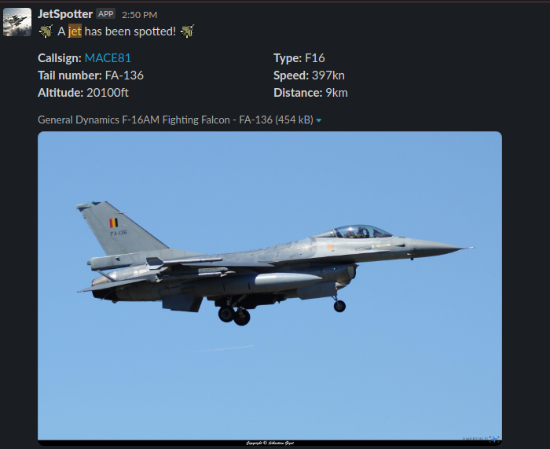

# JetSpotter

JetSpotter is a simple program that queries the ADS-B API.
It is used to send notifications if a specified type of aircraft has been spotted within a specified range of a target location.
If one or more jets have been spotted, a slack notification is sent. The slack notification contains some metadata about the aircraft, a picture fetched from [planespotting.be](www.planespotting.be) and a link to the [ADS-B exchange page](https://globe.adsbexchange.com) of that aircraft.



## Build

Pushing to master triggers the release [workflow](.github/workflows/release.yaml).

## Run

```bash
go run cmd/jetspotter/*
```

## Test

```bash
go test -buildvcs=false ./internal/... -p 1 --count=1
```

## Deploy

The following environment variables have to be set:

* SLACK_WEBHOOK_URL: The Webhook URL to send messages to Slack
* AIRCRAFT_TYPE: The [type of aircraft](./internal/aircraft/aircraft.go) you want to spot, if not specified all types will be spotted
* LOCATION_LATITUDE: The latitude coordinate (e.g.: `51.16951182347571`)
* LOCATION_LONGITUDE: The longitude coordinate of your location (e.g.: `5.470099273882526`)
* MAX_RANGE_KILOMETERS: The maximum range to spot aircraft from your location (default: `30`)
* MAX_AIRCRAFT_SLACK_MESSAGE: The amount of aircraft shown in a single slack message (default: `8`)
