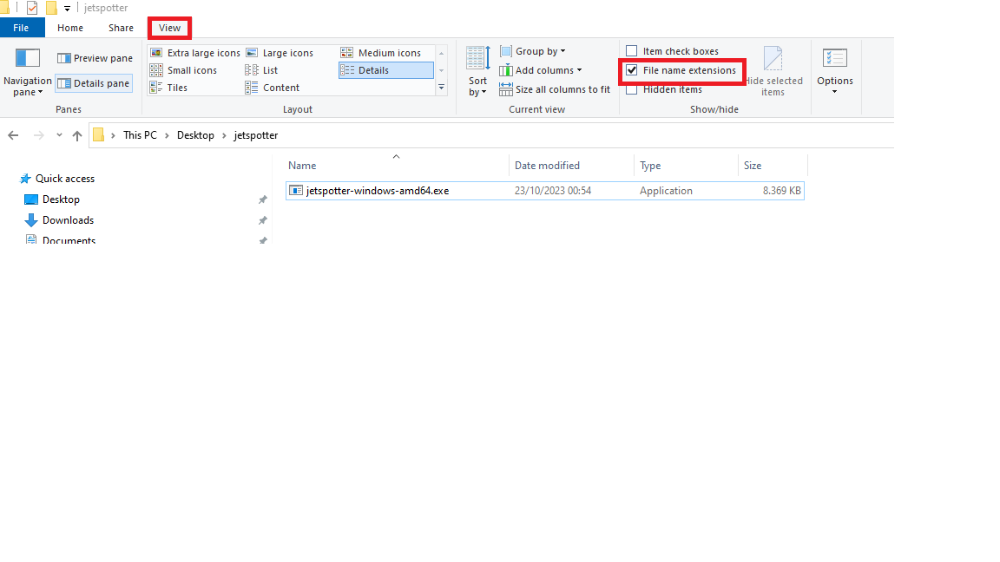

# Overview



## Notifications

Terminal output is always shown. Depending on the [configuration](configuration.md), notifications can also be sent via other media.

### Terminal

[](images/jetspotter-terminal-1.png)

### Slack

[Slack](https://slack.com/) notifications are sent if the `SLACK_WEBHOOK_URL` environment variable is defined.
Documentation how to set up notifications using incoming webhooks can be found in the [official slack documentation](https://api.slack.com/messaging/webhooks).

[](images/jetspotter-slack-1.png)

### Discord

[Discord](https://discord.com/) notifications are sent if the `DISCORD_WEBHOOK_URL` environment variable is defined.
Documentation how to set up notifications using incoming webhooks can be found in the [official discord documentation](https://support.discord.com/hc/en-us/articles/228383668-Intro-to-Webhooks).

By default the color of the embed message is related to the altitude of the aircraft. The color scheme is the same as on the [airplanes map](https://globe.airplanes.live/). This feature can be disabled in the [configuration](configuration.md) to use the same static color for every embed message.

If the altitude color feature is enabled:
[](images/jetspotter-discord-1.png)


If the altitude color feature is disabled:
[](images/jetspotter-discord-2.png)

### Gotify

[Gotify](https://gotify.net/) notifications are sent if the `GOTIFY_URL` and `GOTIFY_TOKEN` environment variables are defined.

[](images/jetspotter-gotify-1.png)

### Ntfy

[Ntfy](https://ntfy.sh/) notifications are sent if the `NTFY_TOPIC` environment variable is defined.

[](images/jetspotter-ntfy-1.png)

### Grafana

[Prometheus](https://prometheus.io/) and [Grafana](https://grafana.com/) can be leveraged to create dashboards.

[](images/jetspotter-grafana-1.png)

## web interface

A web interface is available on port 8080. 
You can log in to access the configration page using the `admin` username and `jetspotter` password. 

[](images/jetspotter-ui-1.png)

## Getting started

### Windows

Download the latest [release](https://github.com/vvanouytsel/jetspotter/releases) that matches your architecture and operating system. If you don't know, then you probably need `jetspotter-windows-amd64`.

Rename the file and add `.exe` as extension. The full name of the file should be `jetspotter-windows-amd64.exe`
By default Windows does not show any file extension. You can enable this by clicking on `View` and checking the `File name extensions` box.

[](images/windows1.png)

Open `Windows PowerShell` and navigate to the directory of the `jetspotter-windows-amd64.exe` file using the `cd` command.

```sh
# Most likely it is stored in your Downloads folder
cd .\Downloads\
```

Specify the configuration variables of your choice and run the application.

[](images/windows2.png)

```powershell
# Spot all aircraft within 40 kilometers of Eiffel Tower and send a Discord notification
$env:LOCATION_LATITUDE="48.85830654260347"
$env:LOCATION_LONGITUDE="2.294309636051661"
$env:MAX_RANGE_KILOMETERS="40"
$env:DISCORD_WEBHOOK_URL="https://discord.com/api/webhooks/XXXXXX/YYYYYY"
.\jetspotter-windows-amd64.exe
```

### Examples

Run jetspotter without extra parameters.

```bash
# Docker
docker run ghcr.io/vvanouytsel/jetspotter:latest

# Binary
./jetspotter
```

Only show F16 and A400 aircraft within 100 kilometers of Kleine-Brogel airbase.

```bash
# Docker
docker run -e LOCATION_LATITUDE=51.1697898378895 -e LOCATION_LONGITUDE=5.470114381971933 -e AIRCRAFT_TYPES=F16,A400 -e MAX_RANGE_KILOMETERS=100 ghcr.io/vvanouytsel/jetspotter:latest


# Binary
LOCATION_LATITUDE=51.1697898378895 LOCATION_LONGITUDE=5.470114381971933 AIRCRAFT_TYPES=F16,A400 MAX_RANGE_KILOMETERS=100 ./jetspotter
```

Show all aircraft within 40 kilometers of Kleine-Brogel airbase and port-forward the UI to `localhost:8080`.

```bash
# Docker
docker run -e LOCATION_LATITUDE=51.1697898378895 -e LOCATION_LONGITUDE=5.470114381971933 -e MAX_RANGE_KILOMETERS=40 -p 8080:8080 ghcr.io/vvanouytsel/jetspotter:latest
```

Show all military aircraft within 20 kilometers of Kleine-Brogel airbase.

```bash
# Docker
docker run -e LOCATION_LATITUDE=51.1697898378895 -e LOCATION_LONGITUDE=5.470114381971933 -e AIRCRAFT_TYPES=MILITARY -e MAX_RANGE_KILOMETERS=20 ghcr.io/vvanouytsel/jetspotter:latest


# Binary
LOCATION_LATITUDE=51.1697898378895 LOCATION_LONGITUDE=5.470114381971933 AIRCRAFT_TYPES=MILITARY MAX_RANGE_KILOMETERS=20 ./jetspotter
```

Scan all aircraft within a radius of 50 kilometers of Kleine-Brogel airbase, but only send notifications for military aircraft within a radius of 30 kilometers. (Aircraft between 30 and 50 kilometers still show up in the UI and the metrics)

```bash
# Docker
docker run -e LOCATION_LATITUDE=51.1697898378895 -e LOCATION_LONGITUDE=5.470114381971933 -e AIRCRAFT_TYPES=MILITARY -e MAX_SCAN_RANGE_KILOMETERS=50 -e MAX_RANGE_KILOMETERS=30 ghcr.io/vvanouytsel/jetspotter:latest


# Binary
LOCATION_LATITUDE=51.1697898378895 LOCATION_LONGITUDE=5.470114381971933 AIRCRAFT_TYPES=MILITARY MAX_SCAN_RANGE_KILOMETERS=50 MAX_RANGE_KILOMETERS=30 ./jetspotter
```

Show all military and AIRBUS A320 aircraft within 30 kilometers of Kleine-Brogel airbase.

```bash
# Docker
docker run -e LOCATION_LATITUDE=51.1697898378895 -e LOCATION_LONGITUDE=5.470114381971933 -e AIRCRAFT_TYPES=MILITARY,A320 -e MAX_RANGE_KILOMETERS=30 ghcr.io/vvanouytsel/jetspotter:latest


# Binary
LOCATION_LATITUDE=51.1697898378895 LOCATION_LONGITUDE=5.470114381971933 AIRCRAFT_TYPES=MILITARY,A320 MAX_RANGE_KILOMETERS=30 ./jetspotter
```

Send a slack notification if one or more aircraft are spotted

```bash
# Docker
docker run -e SLACK_WEBHOOK_URL=https://hooks.slack.com/services/XXX/YYY/ZZZ
 ghcr.io/vvanouytsel/jetspotter:latest

# Binary
SLACK_WEBHOOK_URL=https://hooks.slack.com/services/XXX/YYY/ZZZ ./jetspotter
```

Send a discord notification if one or more aircraft are spotted

```bash
# Docker
docker run -e DISCORD_WEBHOOK_URL=https://discord.com/api/webhooks/XXXXXX/YYYYYY
 ghcr.io/vvanouytsel/jetspotter:latest

# Binary
DISCORD_WEBHOOK_URL=https://discord.com/api/webhooks/XXXXXX/YYYYYY ./jetspotter
```

Send a gotify notification if one or more aircraft are spotted

```bash
# Docker
docker run -e GOTIFY_URL=http://my-gotify-server:85 -e GOTIFY_TOKEN=XXXX
 ghcr.io/vvanouytsel/jetspotter:latest

# Binary
GOTIFY_URL=http://my-gotify-server:85 GOTIFY_TOKEN=XXXX ./jetspotter
```

## Helm

Helm charts are available in the oci registry.
Configuration values can be found in the repository or via [artifact hub](https://artifacthub.io/packages/helm/jetspotter/jetspotter).

```bash
helm install -n jetspotter --create-namespace oci://ghcr.io/vvanouytsel/jetspotter-chart/jetspotter
```

## Releases

Releases can be found on the [GitHub repository](https://github.com/vvanouytsel/jetspotter/releases).

## Container images

[Container images](https://github.com/vvanouytsel/jetspotter/pkgs/container/jetspotter) are also created for each release.
